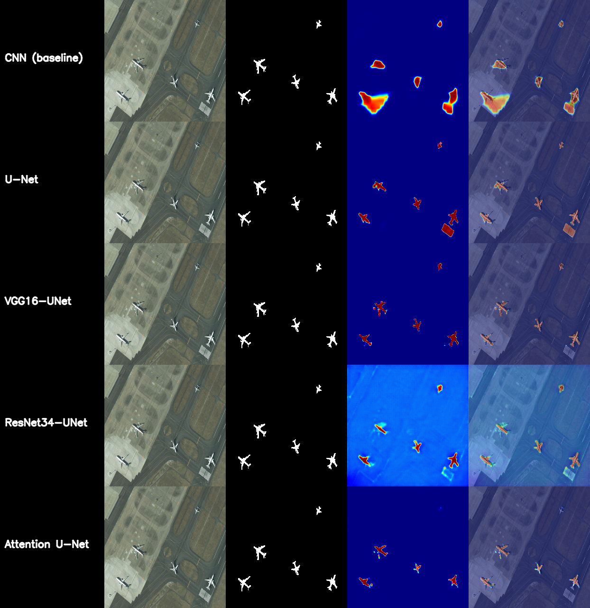

# Saliency Detection on Satellite Imagery (EORSSD)

Deep-learning saliency detection on optical remote-sensing imagery: given a raw
satellite image, predict a heatmap of the regions most likely to draw visual
attention. Five architectures -- CNN, U-Net, ResNet34-UNet, VGG16-UNet, and
Attention U-Net -- are trained and benchmarked against each other on the same
data, loss, and evaluation protocol so the comparison is apples-to-apples.

## Motivation

Satellite imagery is one of the richest sources of information we have about
the planet, but its sheer volume makes manual review impractical. Saliency
detection -- automatically flagging the visually significant regions of an
image -- is a building block for a lot of downstream uses:

- **Disaster response**: quickly surface damaged or affected areas in
  post-event imagery.
- **Urban planning**: highlight infrastructure, roads, and land use patterns.
- **Environmental monitoring**: track ecologically significant regions over
  time.
- **Precision agriculture**: flag crop or soil regions that need attention.

This project explores how well different deep learning architectures handle
that task specifically on overhead/satellite imagery, where backgrounds are
cluttered and objects are small relative to the frame -- a meaningfully
different regime than the everyday photos most saliency-detection research
targets.

## Dataset

[EORSSD](https://github.com/rmcong/EORSSD-dataset) (Extended Optical
Remote Sensing Saliency Detection dataset): 2000 high-resolution satellite
images with binary saliency masks, split 1400 train / 600 test. Images live
under `train-images/`, `train-labels/`, `test-images/`, `test-labels/`.

## Approach

All five models follow an encoder-decoder design with skip connections
carrying high-resolution detail from the encoder straight into the decoder at
every stage -- this is what lets the predicted heatmaps stay sharp and
boundary-accurate instead of degrading into blurry blobs once the image has
been downsampled through several pooling stages.

| Model | Encoder | Skip connections |
|---|---|---|
| `cnn` | plain conv stack | none (baseline) |
| `unet` | trained from scratch | yes, all 4 stages |
| `resnet_unet` | ResNet34 (ImageNet-pretrained) | yes, all 4 stages |
| `vgg_unet` | VGG16-BN (ImageNet-pretrained) | yes, all 5 stages |
| `attention_unet` | ResNet34 (ImageNet-pretrained) | yes, gated (Oktay et al., 2018) |

`attention_unet` adds attention gates at each skip connection: the decoder's
current signal is used to weight the encoder's skip features by relevance
before they're fused in, which helps suppress cluttered backgrounds (roads,
fields, shadows) that would otherwise leak through a plain skip connection.

All models are trained with a hybrid **BCE + IoU + SSIM** loss (BASNet-style)
rather than plain binary cross-entropy. BCE alone treats every pixel
independently and is dominated by the background class, since salient pixels
are a small minority of each EORSSD mask; the IoU and SSIM terms push the
network to get the overall shape and structure of the salient region right,
not just per-pixel label correctness.

Standard data augmentation (flips, 90-degree rotations, mild affine jitter,
color jitter) is applied at training time -- aerial imagery has no canonical
"up," so rotation invariance matters more here than in typical photography
datasets.

## Evaluation

Pixel-wise accuracy is a poor metric for this task: salient pixels are a small
minority of each mask, so a model that predicts mostly background can still
score 80%+ "accuracy" while being qualitatively useless. Instead, this project
evaluates with the standard benchmark protocol used in optical-remote-sensing
saliency-detection research: **MAE**, **max/mean F-measure**, **S-measure**,
and **E-measure**.

## Results

Full 60-epoch run on the EORSSD test set (600 images), trained on a Kaggle GPU
via `notebooks/kaggle_train_demo.ipynb`:

| Model | MAE ↓ | max-F ↑ | mean-F ↑ | S-measure ↑ | E-measure ↑ |
|---|---|---|---|---|---|
| cnn | 0.0403 | 0.6491 | 0.5786 | 0.7255 | 0.6925 |
| unet | 0.0281 | 0.6925 | 0.6634 | 0.7561 | 0.8203 |
| resnet_unet | 0.0917 | 0.8133 | 0.7144 | 0.7490 | 0.8819 |
| attention_unet | 0.0270 | 0.8324 | 0.7850 | 0.8165 | 0.8966 |
| **vgg_unet** | **0.0102** | **0.8419** | **0.8160** | **0.8451** | **0.9363** |

**VGG16-UNet wins outright** -- best on every single metric. Attention U-Net
is a clear second. Both comfortably outperform the from-scratch U-Net and the
CNN baseline, confirming that a pretrained encoder paired with real skip
connections matters a lot on this dataset.

One thing worth calling out: `resnet_unet` has the *worst* MAE (0.0917) despite
solid F-measure/E-measure scores. That combination means it's confidently
over-predicting larger salient regions than the ground truth -- enough false-
positive area to hurt raw pixel error, while still capturing enough of the
true region to score well on the threshold-based and structure-aware metrics.



Each row is [input image | ground truth | predicted heatmap | overlay] for
the same held-out test image.

## Repo layout

```
src/
  data/        EORSSD dataset loader + augmentation pipeline (albumentations)
  models/      cnn, unet, vgg_unet, resnet_unet, attention_unet + shared blocks
  losses/      hybrid BCE + IoU + SSIM loss
  utils/       SOD metrics (MAE, F-measure, S-measure, E-measure), seeding, viz
scripts/
  train.py     trains one model, saves best checkpoint by val loss
  evaluate.py  runs the test set through one or all checkpoints, writes
               outputs/comparison.csv and qualitative [image|gt|heatmap|overlay]
               grids per model
  predict.py   single-image inference -> heatmap overlay (the actual
               end-user deliverable)
  smoke_test.py  CPU-only structural check (shapes, gradients, metrics) -- no
                 dataset or GPU required
notebooks/
  kaggle_train_demo.ipynb  trains + evaluates all 5 models on Kaggle/Colab
configs/default.yaml       hyperparameters
```

## Setup

```bash
pip install -r requirements.txt
```

Place the EORSSD dataset so `train-images/`, `train-labels/`, `test-images/`,
`test-labels/` are visible under a single root directory (download from the
[official EORSSD repo](https://github.com/rmcong/EORSSD-dataset)).

```bash
# sanity-check the code without any data or GPU
python scripts/smoke_test.py

# train one model
python scripts/train.py --model unet --data-root path/to/EORSSD

# evaluate everything you've trained
python scripts/evaluate.py --all --data-root path/to/EORSSD

# run on a single image
python scripts/predict.py --model unet --checkpoint checkpoints/unet_best.pth \
    --image some_satellite_photo.jpg --output heatmap.png
```

For actual training, use `notebooks/kaggle_train_demo.ipynb` on a GPU runtime
(Kaggle or Colab) -- training all 5 models on CPU is impractically slow.

## What's next

- Boundary refinement (e.g. a lightweight CRF or edge-aware loss term) to
  sharpen mask edges further.
- A transformer encoder (e.g. Swin) as a sixth comparison point, since
  attention-based backbones are increasingly the default in recent
  optical-remote-sensing saliency-detection research.
- Deploy `predict.py`'s logic behind a small web demo (Gradio/Streamlit) so
  the heatmap output is interactively explorable, not just a saved PNG.
